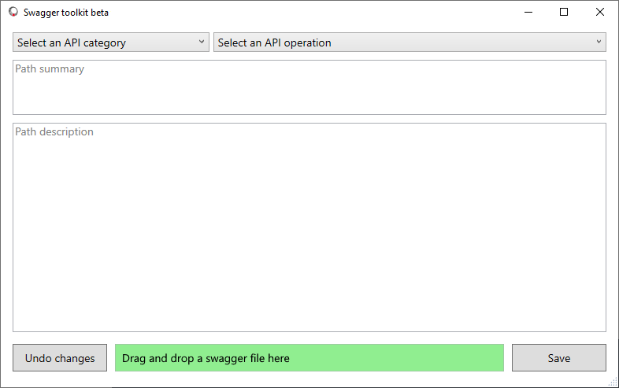
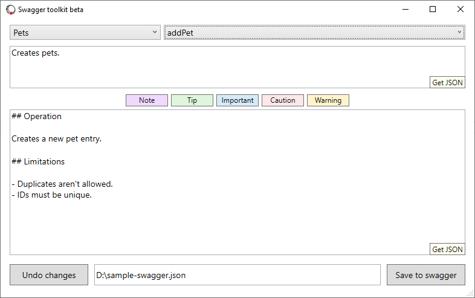

# Swagger toolkit beta

Coming soon to the Microsoft app store.

## Summary

An open source toolkit for editing JSON swagger files.

## Features

- Edit the summary and description fields of REST API paths using multiline Markdown.
- Apply a consistent JSON document format.

## Upcoming features

- Quick insert for tips, notes, and other Markdown constructs.
- Configurable character escaping options.
- Support for editing other swagger fields.
- Support for running an autorest or other script.

## Getting started

1. To get started, drag and drop a JSON swagger file onto the path field. Here's a sample [petstore swagger file](./resources/samples/petstore.json).

    

2. Choose from the **Select an API category** dropdown (lists swagger [tags](https://swagger.io/docs/specification/grouping-operations-with-tags/)).

3. Choose from the **Select an API operation** dropdown (lists swagger [operationIds](https://swagger.io/docs/specification/paths-and-operations/)).

4. Edit the summary and/or description fields.

    

5. Choose **Undo changes** or **Save** to respectively discard or save your edits for the current API operation. Navigating to a new API operation will discard unsaved edits.

6. Use a diff viewer to double-check your changes.

## Manually compile a single file executable

Although it's easier to install the app from the Microsoft Store, you can compile and install the app using Visual Studio.

### Prerequisites

- [.NET 5+](https://dotnet.microsoft.com/download)
- [Visual Studio 2019+](https://visualstudio.microsoft.com/vs/)

### Create an executable

1. Open the project in Visual Studio.

1. From the menu bar, choose **Build** > **Publish...**.

1. Choose to publish to a folder, then select **Finish**.

1. Choose **Show all settings**.

1. Choose **Framework-dependent** and **Produce single file** in the profile settings, and note the **Target location** of the compiled executable.

1. Choose **Publish**.
